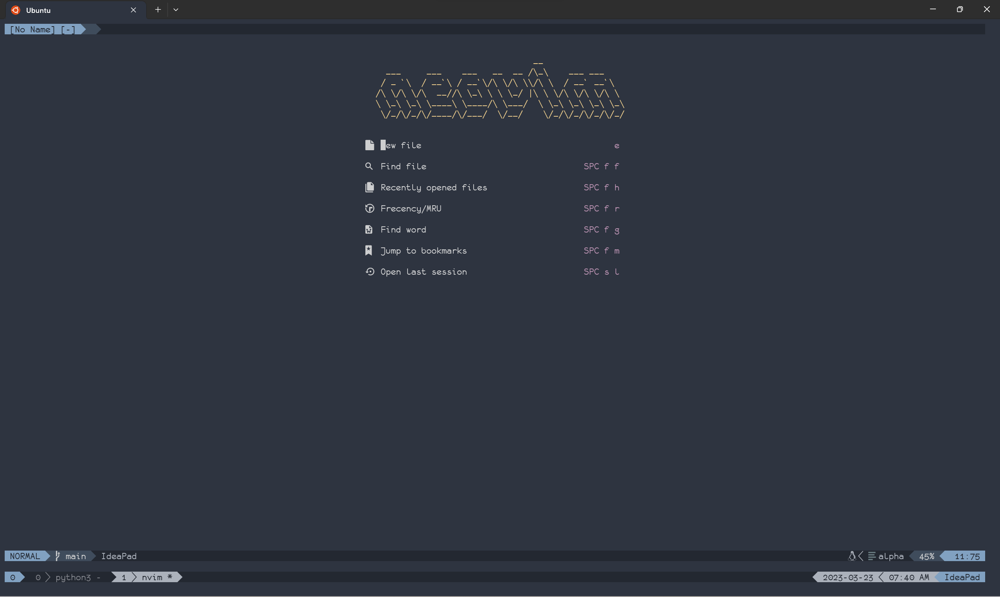

# Neovim configuration

## Preview

This is what nvim will look like when debugging a c++ file.

## What this is
A configuration file for neovim, for c/c++, python developments.
Its main features are:
* Syntax highlighting
* LSP
* Debugging
* Terminal integration
* Fuzzy finding
* Code completion
* Snippets
* File explorer

## Direcories and files
* maps.lua -- contains keymapping for nvim's plugin.
* init.lua -- mainly "require" other files
* plugins.lua -- packer is here
* visual.lua -- setting to do with the aesthetics of the editor
* setting.lua -- other settings that did not go into the files above
* lua/ -- All plugin configuration is done here

## How to use
1. Copy the files under ~/.config/nvim
2. Open plugins.lua with nvim, and saving it (:w) will automatically install package manager and plugins.
3. Check that your environment matches mason requirements using ":checkhealth mason"
4. If anything is missing, then install/update it
5. Change the path to python interpreter with debugpy on file lua/nvim-dap-python_conf.lua. (See the nim-dap and nim-dap-python for detailed information)
6. Download the language config files for tree sitter using :TSInstall command, eg. TSInstall python. This will enable syntax highlighting.

If the icons are not showing, make sure that you have installed Nerd Font on your system.

Edit the file "maps.lua" to configure the mapping to your own needs.
Note that for some plugins, the key bindings are not explicitly set up in maps.lua
and uses default key bindings.

## When installing new plugins
1. Get the plugin using packer by adding to plugins.lua
2. Write a configuration file for the plugin (if you need to)
3. "require" that file from init.lua

# Warning
If you are going to use github to sync the setting of neovim for your devices, I highly suggest branching this repository. (I would probably add more plugins to this repository, meaning that a push to master can suddenly change *your* mapping/plugins)
